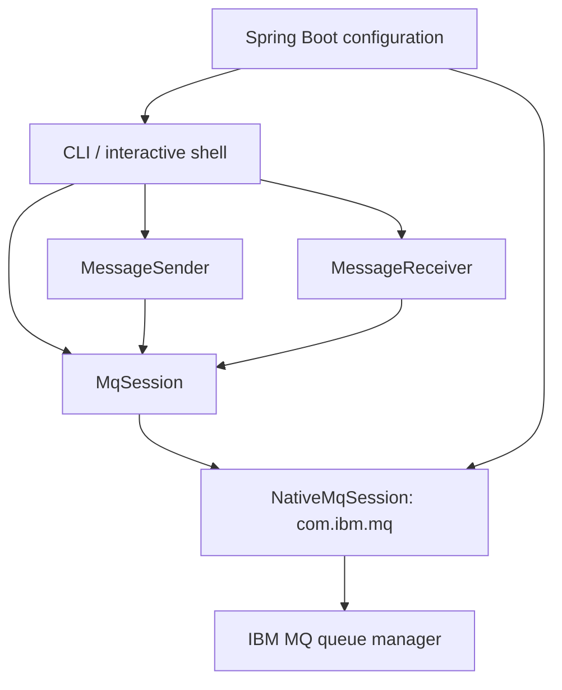
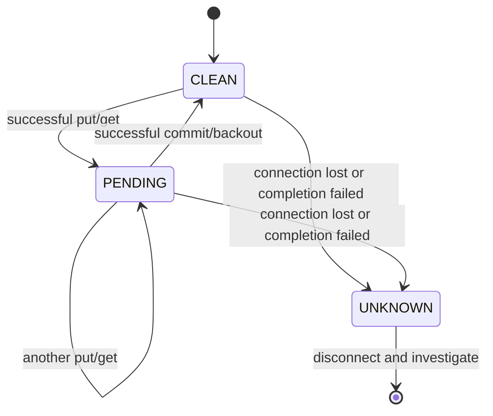

# Architecture and explicit transactions

Spring owns configuration and object wiring, not connections or transaction boundaries. There is no `@Transactional`, connection factory, `JmsTemplate`, `@JmsListener`, or background receive loop. A sender/receiver operation owns its connection until completion; the shell owns one connection until disconnect/quit. A session is confined to its creating thread. Independent tasks must use independent sessions.

## Operation mapping

| Lab method             | Native API / meaning                                                                        |
|------------------------|---------------------------------------------------------------------------------------------|
| `connect()`            | `new MQQueueManager(name, properties)`; client-mode TCP connection and MQCSP credentials    |
| `disconnect()`         | Back out known pending work, close cached queue handles, then `MQQueueManager.disconnect()` |
| `isConnected()`        | `MQQueueManager.isConnected()`; locally observed state, no network round trip               |
| `putMessage()`         | `MQQueue.put()` with `MQPMO_SYNCPOINT`, persistent UTF-8 `MQFMT_STRING`, new MQ ID          |
| `getMessage()`         | `MQQueue.get()` with `MQGMO_SYNCPOINT`; bounded wait, optional exact MQ message ID          |
| `getInQueueMsgCount()` | Open with `MQOO_INQUIRE`, then `MQQueue.getCurrentDepth()`                                  |
| `commit()`             | `MQQueueManager.commit()` commits all pending operations on that connection                 |
| `backout()`            | `MQQueueManager.backout()` rolls them all back                                              |

In this lab `GetMessage` returns text with metadata, not a Jakarta `Message`. A queue manager owns queues, the listener port accepts client traffic, and a SVRCONN channel defines the client connection path/identity rules. `DEV.LAB.IN` and `DEV.LAB.OUT` are teaching labels: IBM MQ can put/get either queue if the user's permissions allow it.

## Puts and gets are transactional

A persistent flag and a transaction solve different problems. Persistence asks MQ to preserve a **committed** message across queue-manager recovery; syncpoint lets you commit or cancel a group of operations. This lab explicitly specifies syncpoint for both put and get; it does not depend on platform defaults.

- Put → commit: publish the message for consumers.
- Put → backout: cancel the 'send'.
- Get → commit: finalize removal.
- Get → backout: make the received message available again; `BackoutCount` may increase.
- Put + get on one connection → commit/backout applies to both together.

A retrieved message is still pending while the caller processes it. If decoding fails, the state is already marked pending so closing the session rolls it back. The app supports string payloads up to 1 MiB; it deliberately does not interpret arbitrary binary formats, JMS RFH2 headers, or application schemas. Oversized messages are not accepted truncated.

The native API does not automatically move repeatedly failing messages to a backout queue. This lab returns the backout count for observation and leaves poison-message policy as a later exercise. Do not build an infinite retry loop around an unreadable message.

## State and failure behavior

`UNKNOWN` blocks further messaging and completion calls on that session. A lost connection during commit can leave the client unable to know whether the server committed. Disconnect does not resolve that uncertainty. Reconnect is an explicit new session lifecycle; it does not replay old messages. There is no automatic retry or claim of exactly-once business processing across MQ and an external database.

Closing a pending session attempts backout, every queue close, and disconnect even when an earlier cleanup fails. Cleanup errors are attached as suppressed exceptions. An explicitly disconnected session can reconnect, but production recovery would require identifying/reconciling uncertain operations before retrying them.

`isConnected()` can report true after a network failure until an operation observes the failure. `depth`/one-shot `status` perform a server inquiry, which is a useful lab check but cannot prove the next operation will succeed. Depth is a snapshot and may include messages that are unavailable because they participate in another unit of work. Avoid using depth to decide whether a get will return a message.

## Why this baseline?

This lab exposes the IBM MQ lifecycle and transaction calls directly so their behavior can be compared with later Jakarta Messaging and Spring JMS labs. IBM MQ classes for Java have been stabilized; IBM continues maintenance but steers new functional development toward its newer interfaces. “Native” here names the proprietary Java API, not JNI or a requirement to install a native MQ client on the host: the Java client can connect remotely using the allclient JAR.

For a later comparison, keep the scenarios and queue setup and create separate labs using Jakarta Messaging, then Spring JMS. Compare resource ownership, receive scheduling, error recovery and transaction boundaries, rather than mixing three transport implementations in this minimal project.

Official references:

- [MQQueueManager](https://www.ibm.com/docs/en/ibm-mq/9.4.x?topic=java-mqqueuemanager)
- [MQQueue](https://www.ibm.com/docs/en/ibm-mq/9.4.x?topic=java-mqqueue)
- [IBM MQ classes for Java](https://www.ibm.com/docs/en/ibm-mq/9.4.x?topic=applications-mq-classes-java)
- [IBM MQ container usage](https://github.com/ibm-messaging/mq-container/blob/master/docs/usage.md)
